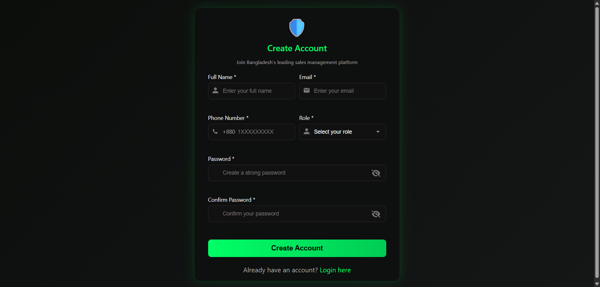
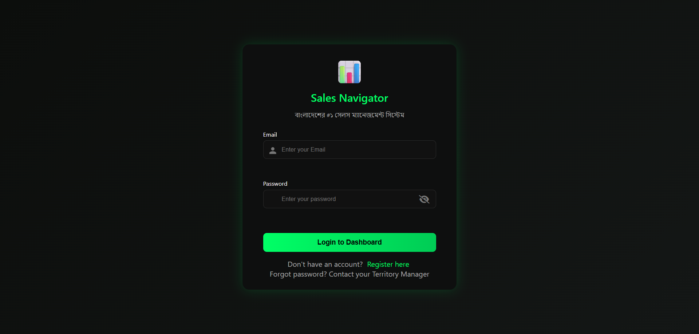
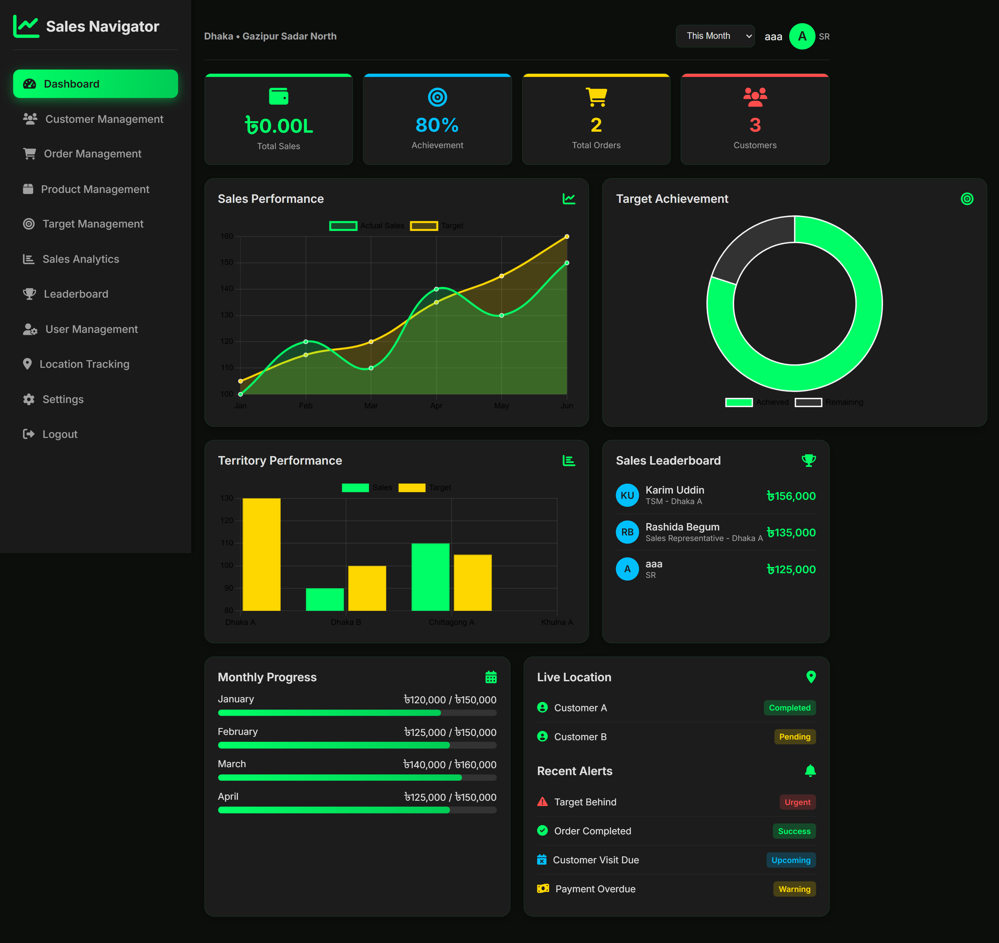
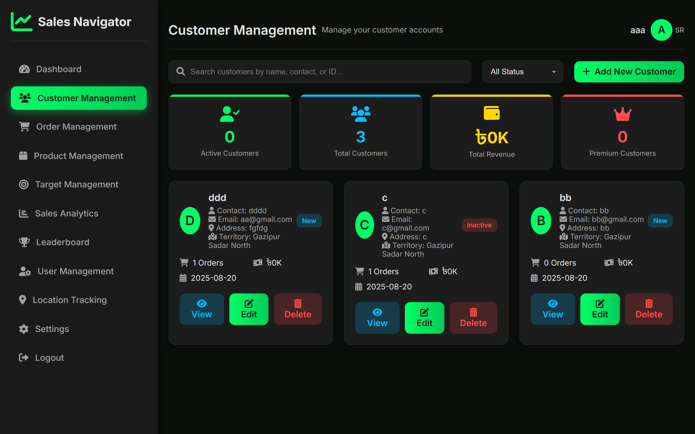
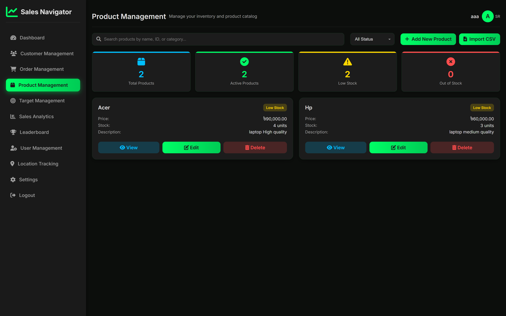
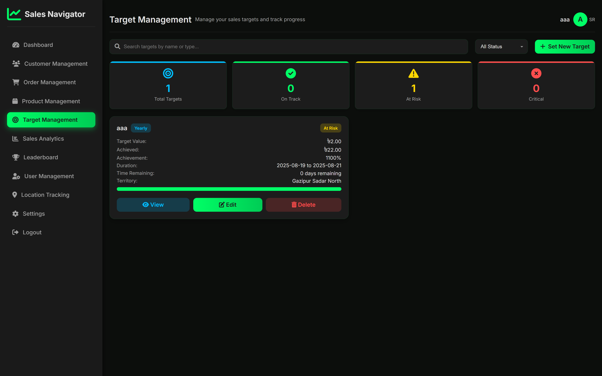
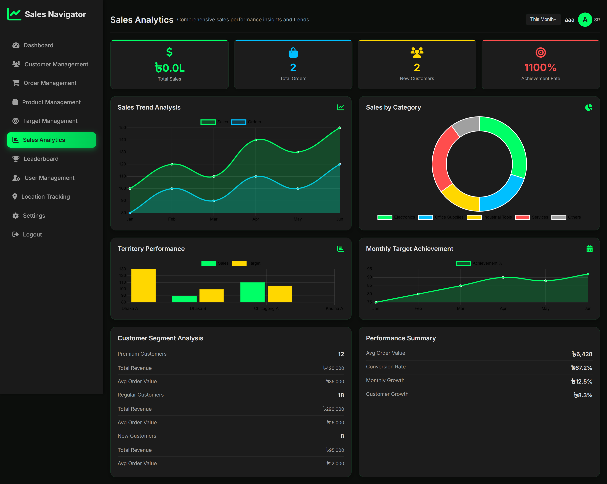
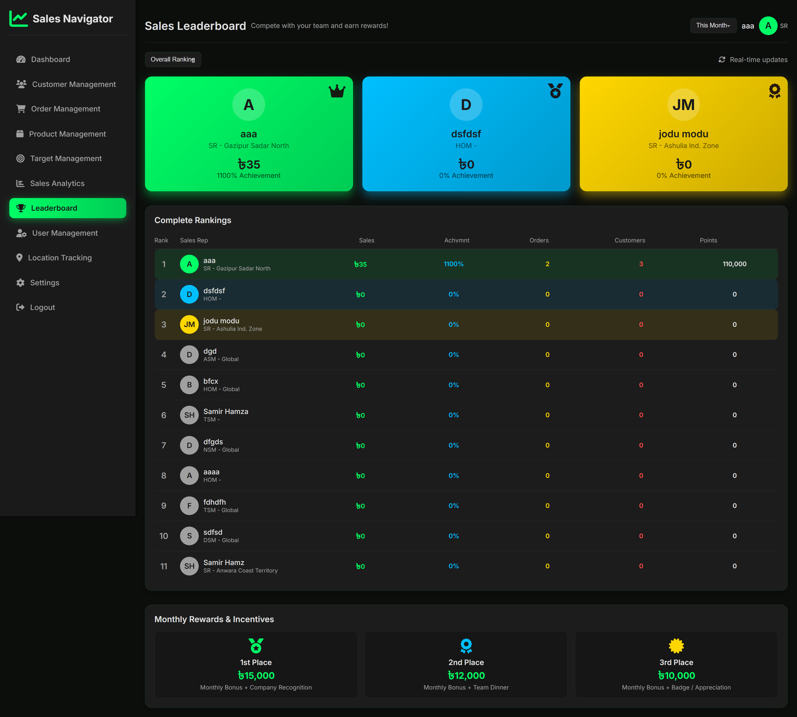
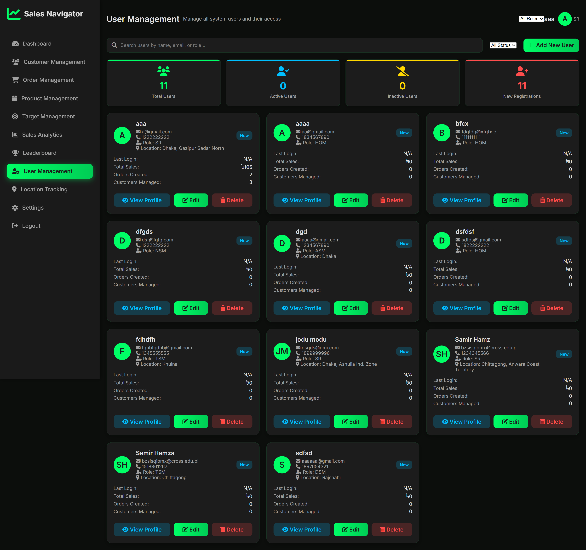
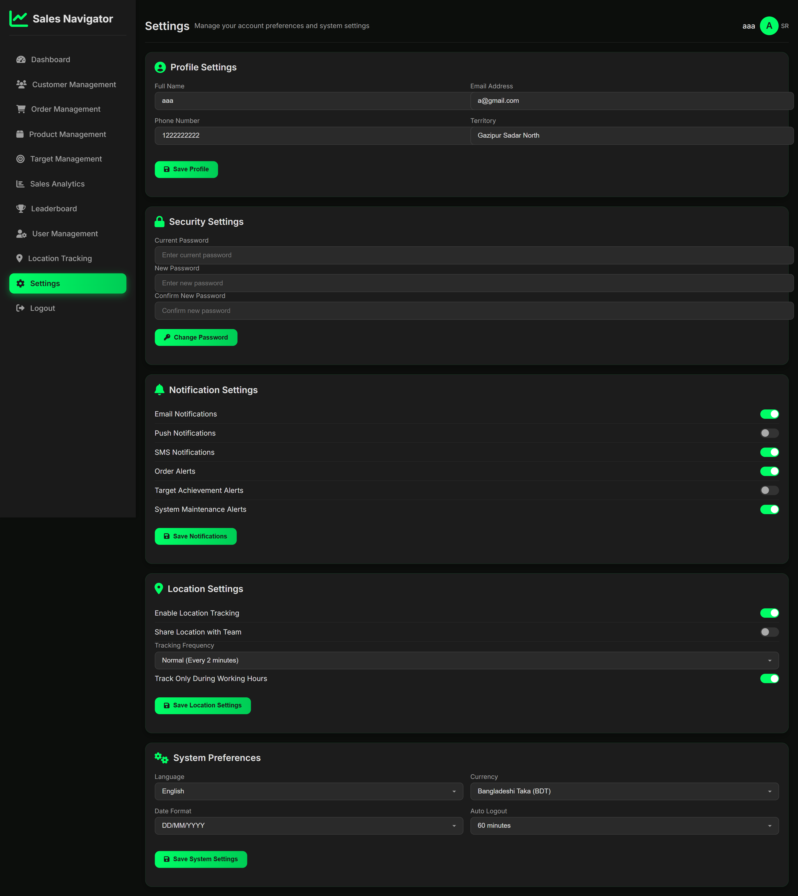

# Sales Representative Management System

A powerful, intuitive dashboard designed to help sales teams track, analyze, and improve their performance. This application provides real-time insights, team management capabilities, and geographic tracking to optimize sales operations.

## Screenshots

| Homepage | Register |
|:---:|:---:|
|  |  |

| Login | Dashboard |
|:---:|:---:|
|  |  |

| Customers | Orders |
|:---:|:---:|
|  |  |

| Product | Target |
|:---:|:---:|
|  |  |

| Sales | Leaderboard |
|:---:|:---:|
|  |  |

| User Management | Settings |
|:---:|:---:|
|  |  |

## 🚀 Key Features

-   **Real-Time Dashboard**: Visual analytics for sales performance, growth rates, and active users.
-   **Order Management**: Streamlined process for tracking and managing customer orders.
-   **Customer Management**: Comprehensive database of customers with segmentation and status tracking.
-   **Geographic Insights**: Track performance across divisions, districts, and territories (specifically tailored for Bangladesh).
-   **Target Management**: Set and monitor sales targets (Monthly, Quarterly, Yearly) for individuals and teams.
-   **Leaderboard**: Real-time rankings to foster healthy competition among sales representatives.
-   **Product Catalog**: Manage products, categories, and stock levels.
-   **User Management**: Role-based access control (HOM, NSM, DSM, ASM, TSM, SR).
-   **Responsive Design**: Fully accessible on mobile and desktop devices.

## 🛠️ Technology Stack

-   **Frontend**: HTML5, CSS3, Bootstrap 5, JavaScript
-   **Backend**: PHP (Native)
-   **Database**: MySQL
-   **Visualization**: Chart.js
-   **Animations**: AOS (Animate On Scroll) library
-   **Icons**: FontAwesome 6

## 📋 Prerequisites

Before you begin, ensure you have the following installed:
-   PHP (v7.4 or higher recommended)
-   MySQL (v5.7 or higher)
-   Apache Web Server (e.g., via XAMPP, WAMP, or MAMP)

## ⚙️ Installation

1.  **Clone the Repository**
    ```bash
    git clone <repository-url>
    cd Sales_Representative_Project
    ```

2.  **Database Setup**
    -   Open your database management tool (e.g., phpMyAdmin).
    -   Create a new database named `sales_navigator_db`.
    -   Import the provided SQL file: `sql/sales_navigator_db.sql`.

3.  **Configuration**
    -   Open `db_connect.php`.
    -   Update the database credentials if necessary:
        ```php
        $servername = "localhost";
        $username = "root"; // Your DB username
        $password = "";     // Your DB password
        $dbname = "sales_navigator_db";
        ```

4.  **Run the Application**
    -   Move the project folder to your web server's root directory (e.g., `htdocs` for XAMPP).
    -   Open your browser and navigate to:
        `http://localhost/Sales_Representative_Project/php/homepage.php`

## 👥 User Roles

The system supports various hierarchical roles:
-   **HOM** (Head of Marketing/Management)
-   **NSM** (National Sales Manager)
-   **DSM** (Divisional Sales Manager)
-   **ASM** (Area Sales Manager)
-   **TSM** (Territory Sales Manager)
-   **SR** (Sales Representative)

## 👥 Authors & Credits

### Project Development
- **Repository Owner**: [Abdullah Al Noman](https://github.com/nomanrafi)
- **Project Name**: Sales Representative Management System
- **Developed**: 2025

## 📄 License

This project is open source and available for use and modification.
